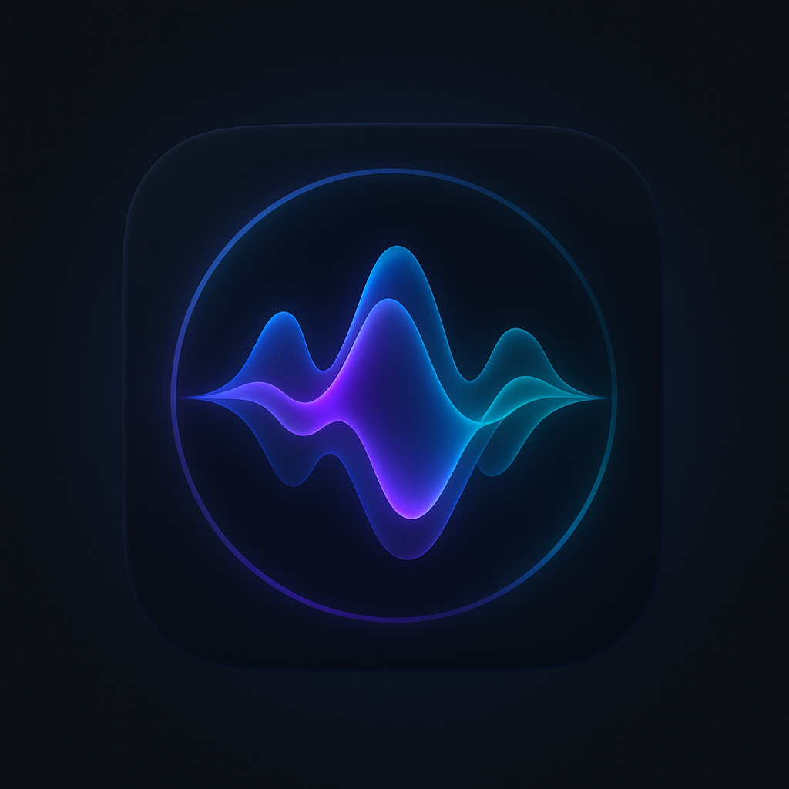

# Veda - On-Device Voice Assistant

Veda is an advanced on-device voice assistant app built with Swift and powered by Google's Gemma 2B CoreML models. It features real-time speech recognition, text-to-speech synthesis, conversation management, and a beautiful modern UI.



## ✨ Features

- **🎙️ Voice Interaction**: Real-time speech-to-text with visual feedback
- **🤖 AI Responses**: Powered by Google Gemma 2B CoreML models (128-bit and 4-bit quantized)
- **🔊 Text-to-Speech**: Natural voice synthesis with customizable speed and pitch
- **💬 Conversation History**: Save, export, and manage conversation threads
- **⚙️ Advanced Settings**: Voice controls, model selection, and data management
- **📱 Modern UI**: Clean, intuitive interface with haptic feedback
- **🔒 Privacy First**: All processing happens on-device
- **📂 Data Export**: Export conversations to Markdown format
- **🎨 Splash Screen**: Beautiful animated launch experience

## 🚀 Quick Start

### Prerequisites

- **macOS**: macOS 12.0 or later
- **Xcode**: Xcode 14.0 or later
- **iOS Device**: iOS 16.0 or later (for testing)
- **Python**: Python 3.7 or later
- **Internet**: Required for initial model download

### 1. Clone the Repository

```bash
git clone https://github.com/TVR28/On-Device-Voice-Assistant.git
cd On-Device-Voice-Assistant
```

### 2. Download Models

The app requires large CoreML models (~6.5GB total) that are stored separately on Hugging Face. Run the setup script to download them:

```bash
# Make sure you have internet connection
./setup_models.sh
```

**What this script does:**
- Downloads Gemma-2B-IT-Stateful-128.mlpackage (~5GB)
- Downloads Gemma-2B-IT-Stateful-4bit-128.mlpackage (~1.4GB) 
- Places models in the correct locations for Xcode builds
- Sets up the directory structure automatically

**Note**: The models are stored in a private Hugging Face repository. The script uses cached authentication from the development setup.

### 3. Open in Xcode

```bash
open VoiceFoundationApp/VoiceFoundationApp.xcodeproj
```

### 4. Build and Run

1. Select your target device (iPhone/iPad or Simulator)
2. Build and run the project (⌘+R)
3. Grant microphone permissions when prompted
4. Start chatting with Veda!

## 🏗️ Architecture

### Core Components

- **ContentView**: Main interface with voice interaction UI
- **SpeechManager**: Handles speech recognition and text-to-speech
- **MockLLMManager**: Manages AI model inference and streaming responses
- **ConversationManager**: Handles conversation persistence and management
- **SettingsView**: Configuration and preferences management
- **SplashScreenView**: Animated launch screen

### Model Integration

The app uses Google's Gemma 2B models converted to CoreML format:

- **Gemma-2B-IT-Stateful-128**: Full precision model for maximum quality
- **Gemma-2B-IT-Stateful-4bit-128**: Quantized model for faster inference

Models are loaded dynamically based on user preference and device capabilities.

## 🎛️ Features in Detail

### Voice Interaction
- Tap and hold to record voice input
- Real-time visual feedback during recording
- Automatic voice mode with hands-free operation
- Customizable TTS voice settings (speed, pitch)

### Conversation Management
- Persistent conversation history
- Export conversations to Markdown
- Custom storage locations
- Search and filter conversations

### Settings & Customization
- Model selection (128-bit vs 4-bit)
- Voice synthesis controls
- Data management options
- Performance monitoring

### Privacy & Security
- All processing happens on-device
- No data sent to external servers
- Local conversation storage
- User-controlled data export

## 📱 System Requirements

### Minimum Requirements
- iOS 16.0+
- iPhone 12 or newer (A14 Bionic chip)
- 8GB+ free storage space
- Microphone access

### Recommended
- iOS 17.0+
- iPhone 14 Pro or newer
- 16GB+ free storage space
- Stable internet for initial setup

## 🛠️ Development Setup

### Model Development
The CoreML models are converted from the original Gemma PyTorch models using Apple's coremltools. The conversion process includes:

1. Model optimization for Neural Engine
2. Quantization for size/speed tradeoffs  
3. Stateful configuration for conversation context
4. Integration testing with CoreML runtime

### File Structure
```
VoiceFoundationApp/
├── VoiceFoundationApp/
│   ├── ContentView.swift              # Main UI
│   ├── SpeechManager.swift            # Speech processing
│   ├── MockLLMManager.swift           # AI model interface
│   ├── ConversationManager.swift     # Data persistence
│   ├── SettingsView.swift             # Configuration UI
│   ├── SplashScreenView.swift         # Launch screen
│   ├── Models.swift                   # Data models
│   └── Assets.xcassets/               # Images and icons
├── VoiceFoundationAppTests/           # Unit tests
└── VoiceFoundationAppUITests/         # UI tests
```

## 🤝 Contributing

1. Fork the repository
2. Create your feature branch (`git checkout -b feature/AmazingFeature`)
3. Commit your changes (`git commit -m 'Add some AmazingFeature'`)
4. Push to the branch (`git push origin feature/AmazingFeature`)
5. Open a Pull Request

## 📄 License

This project is licensed under the MIT License - see the [LICENSE](LICENSE) file for details.

## 🙏 Acknowledgments

- **Google**: For the Gemma model architecture and weights
- **Apple**: For CoreML framework and Neural Engine optimization
- **Hugging Face**: For model hosting and distribution
- **Swift Community**: For excellent documentation and resources

## 📞 Support

If you encounter any issues:

1. **Model Download Issues**: Ensure you have a stable internet connection and sufficient storage space
2. **Build Errors**: Make sure you're using Xcode 14+ and iOS 16+ deployment target
3. **Performance Issues**: Try using the 4-bit quantized model for faster inference
4. **Voice Recognition**: Check microphone permissions in iOS Settings

For additional support, please open an issue in the GitHub repository.

---

**Made with ❤️ by the Veda Team** 