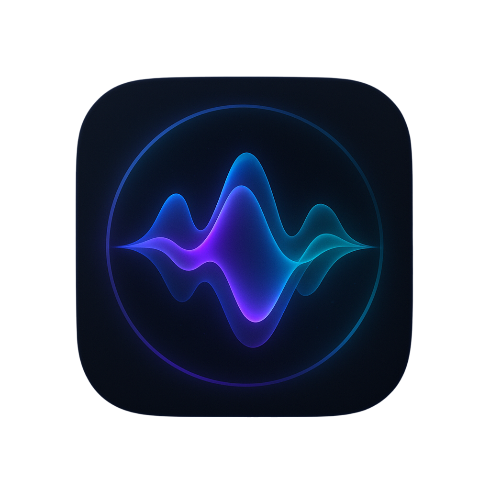
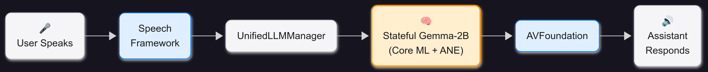

<div align="center">
  
  <h1>Veda - On-Device Voice Assistant</h1>
  <p>
    <strong>🤖 Advanced AI-powered voice assistant running entirely on-device</strong><br>
    Built with Swift and powered by Google's Gemma 2B CoreML models
  </p>
  
  <!-- Badges -->
  <p>
    
    
    
    
    
    
  </p>
  
  <p>
    <strong>📱 Real-time voice interaction • 🎙️ Speech recognition • 🔊 Text-to-speech • 💬 Conversation management</strong>
  </p>
</div>

---

## ✨ Features

<table>
<tr>
<td width="50%">

### 🎯 **Core Capabilities**
- **🎙️ Voice Interaction**: Real-time speech-to-text with visual feedback
- **🤖 AI Responses**: Powered by Gemma 2B CoreML models  
- **🔊 Text-to-Speech**: Natural voice synthesis with customization
- **💬 Smart Conversations**: Context-aware dialogue management

</td>
<td width="50%">

### ⚙️ **Advanced Features**
- **📱 Modern UI**: Clean interface with haptic feedback
- **🔒 Privacy First**: All processing happens on-device
- **📂 Data Export**: Export conversations to Markdown
- **🎨 Beautiful Design**: Animated splash screen & smooth UX

</td>
</tr>
</table>

## 🚀 Quick Start

> **⚡ Get Veda running in under 5 minutes!**

### Prerequisites

<table>
<tr>
<td><strong>💻 System</strong></td>
<td>macOS 12.0+, Xcode 14.0+</td>
</tr>
<tr>
<td><strong>📱 Device</strong></td>
<td>iOS 16.0+, iPhone 12+ recommended</td>
</tr>
<tr>
<td><strong>💾 Storage</strong></td>
<td>8GB+ free space (for models)</td>
</tr>
<tr>
<td><strong>🌐 Network</strong></td>
<td>Internet required for initial model download</td>
</tr>
</table>

### 🛠️ Installation

```bash
# 1️⃣ Clone the repository
git clone https://github.com/TVR28/On-Device-Voice-Assistant.git
cd On-Device-Voice-Assistant

# 2️⃣ Download AI models (automated setup)
./setup_models.sh

# 3️⃣ Open in Xcode
open VoiceFoundationApp/VoiceFoundationApp.xcodeproj

# 4️⃣ Build & Run (⌘+R) - Grant microphone permissions when prompted
```

> **🔥 That's it! Veda is ready to chat with you.**

## 🤖 AI Models

Veda uses Google's cutting-edge Gemma 2B models, optimized for Apple Silicon:

<table>
<tr>
<th>Model</th>
<th>Size</th>
<th>Precision</th>
<th>Use Case</th>
</tr>
<tr>
<td><strong>Gemma-2B-IT-Stateful-128</strong></td>
<td>~5GB</td>
<td>Full (128-bit)</td>
<td>Maximum quality responses</td>
</tr>
<tr>
<td><strong>Gemma-2B-IT-Stateful-4bit-128</strong></td>
<td>~1.4GB</td>
<td>Quantized (4-bit)</td>
<td>Faster inference, lower memory</td>
</tr>
</table>

**🔒 Privacy**: Models are stored in a private Hugging Face repository and run entirely on-device.

## 🏗️ Architecture

<div align="center">
  
</div>

### Core Components

| Component | Responsibility |
|-----------|----------------|
| **ContentView** | Main UI with voice interaction controls |
| **SpeechManager** | Speech recognition & text-to-speech synthesis |
| **MockLLMManager** | AI model inference & streaming responses |
| **ConversationManager** | Persistent conversation storage |
| **SettingsView** | Configuration & preferences |

## 🎛️ Advanced Features

<details>
<summary><strong>🎙️ Voice Interaction</strong></summary>

- **Tap & Hold**: Record voice input with real-time feedback
- **Hands-free Mode**: Automatic voice activation
- **Custom TTS**: Adjustable speed, pitch, and voice selection
- **Smart Detection**: Automatic speech start/stop detection

</details>

<details>
<summary><strong>💬 Conversation Management</strong></summary>

- **Persistent History**: All conversations saved locally
- **Smart Export**: Export to Markdown with metadata
- **Custom Storage**: Choose your own storage location
- **Search & Filter**: Find conversations quickly

</details>

<details>
<summary><strong>⚙️ Customization</strong></summary>

- **Model Selection**: Switch between 128-bit and 4-bit models
- **Voice Controls**: Fine-tune TTS parameters
- **Privacy Settings**: Control data retention
- **Performance Tuning**: Optimize for your device

</details>

## 📱 System Requirements

<table>
<tr>
<td colspan="2" align="center"><strong>🔵 Minimum Requirements</strong></td>
</tr>
<tr>
<td><strong>iOS Version</strong></td>
<td>iOS 16.0 or later</td>
</tr>
<tr>
<td><strong>Device</strong></td>
<td>iPhone 12 or newer (A14 Bionic+)</td>
</tr>
<tr>
<td><strong>Storage</strong></td>
<td>8GB+ free space</td>
</tr>
<tr>
<td><strong>RAM</strong></td>
<td>6GB+ recommended</td>
</tr>
</table>

<table>
<tr>
<td colspan="2" align="center"><strong>🟢 Recommended Setup</strong></td>
</tr>
<tr>
<td><strong>iOS Version</strong></td>
<td>iOS 17.0 or later</td>
</tr>
<tr>
<td><strong>Device</strong></td>
<td>iPhone 14 Pro or newer</td>
</tr>
<tr>
<td><strong>Storage</strong></td>
<td>16GB+ free space</td>
</tr>
<tr>
<td><strong>Network</strong></td>
<td>Stable internet for setup</td>
</tr>
</table>

## 🛠️ Development

### File Structure
```
VoiceFoundationApp/
├── VoiceFoundationApp/
│   ├── ContentView.swift              # 🎨 Main UI
│   ├── SpeechManager.swift            # 🎙️ Speech processing
│   ├── MockLLMManager.swift           # 🤖 AI model interface
│   ├── ConversationManager.swift     # 💾 Data persistence
│   ├── SettingsView.swift             # ⚙️ Configuration UI
│   ├── SplashScreenView.swift         # ✨ Launch screen
│   ├── Models.swift                   # 📋 Data models
│   └── Assets.xcassets/               # 🖼️ Images and icons
├── VoiceFoundationAppTests/           # 🧪 Unit tests
└── VoiceFoundationAppUITests/         # 🖱️ UI tests
```

### Model Pipeline
The CoreML models undergo extensive optimization:

1. **🔄 Conversion**: PyTorch → CoreML using Apple's tools
2. **⚡ Optimization**: Neural Engine acceleration
3. **📦 Quantization**: Size/speed optimization
4. **🔄 Stateful Config**: Conversation context preservation

## 🤝 Contributing

We welcome contributions! Here's how to get started:

1. **🍴 Fork** the repository
2. **🌿 Create** your feature branch (`git checkout -b feature/AmazingFeature`)
3. **💾 Commit** your changes (`git commit -m 'Add some AmazingFeature'`)
4. **📤 Push** to the branch (`git push origin feature/AmazingFeature`)
5. **🔀 Open** a Pull Request

## 📄 License

This project is licensed under the **MIT License** - see the [LICENSE](LICENSE) file for details.

## 🙏 Acknowledgments

<table>
<tr>
<td align="center">
<strong>🏢 Google</strong><br>
Gemma model architecture
</td>
<td align="center">
<strong>🍎 Apple</strong><br>
CoreML & Neural Engine
</td>
<td align="center">
<strong>🤗 Hugging Face</strong><br>
Model hosting platform
</td>
</tr>
</table>

## 📞 Support & Troubleshooting

<details>
<summary><strong>🔧 Common Issues</strong></summary>

| Issue | Solution |
|-------|----------|
| **📥 Model Download Fails** | Check internet connection & storage space |
| **🔨 Build Errors** | Ensure Xcode 14+ and iOS 16+ target |
| **🐌 Slow Performance** | Try 4-bit quantized model |
| **🎤 Voice Not Working** | Check microphone permissions in Settings |

</details>

<details>
<summary><strong>💡 Performance Tips</strong></summary>

- **🔋 Battery**: Use 4-bit model for longer battery life
- **🚀 Speed**: Ensure sufficient free RAM (6GB+)
- **📱 Device**: iPhone 14 Pro+ for best experience
- **🔊 Audio**: Use wired headphones for best voice recognition

</details>

---

<div align="center">
  <p>
    <strong>Made with ❤️ by the Veda Team</strong><br>
    <sub>Bringing AI conversations to your pocket, privately and securely</sub>
  </p>
  
  <p>
    <a href="https://github.com/TVR28/On-Device-Voice-Assistant/issues">🐛 Report Bug</a> •
    <a href="https://github.com/TVR28/On-Device-Voice-Assistant/issues">💡 Request Feature</a> •
    <a href="https://github.com/TVR28/On-Device-Voice-Assistant/discussions">💬 Discussions</a>
  </p>
  
  <p>
    <strong>⭐ Star this repo if you found it helpful!</strong>
  </p>
</div> 